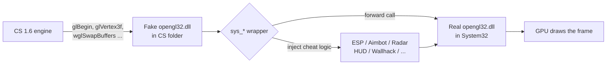
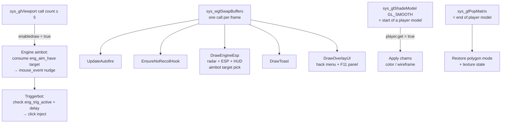

# Architecture — cs16-opengl-research

How the hack is structured and what happens at runtime. For usage instructions
see [README.md](./README.md). For build instructions see [BUILDING.md](./BUILDING.md).

---

## Table of Contents

- [Proxy DLL concept](#proxy-dll-concept)
- [High-level architecture](#high-level-architecture)
- [Per-frame pipeline](#per-frame-pipeline)
- [Feature internals](#feature-internals)
  - [Wallhack](#wallhack)
  - [Engine entity-list ESP](#engine-entity-list-esp)
  - [Radar](#radar)
  - [Own HUD (HP / Ammo arcs)](#own-hud-hp--ammo-arcs)
  - [Spectator warning ("who's watching me")](#spectator-warning-whos-watching-me)
  - [Chams](#chams)
  - [Aimbot](#aimbot)
  - [Triggerbot](#triggerbot)
  - [Auto-fire](#auto-fire)
  - [Auto bunnyhop](#auto-bunnyhop)
  - [No-recoil detour](#no-recoil-detour)
  - [No Flash / No Smoke / No Sky](#no-flash--no-smoke--no-sky)
  - [Hack menu and config persistence](#hack-menu-and-config-persistence)

---

## Proxy DLL concept

The game renders through `opengl32.dll`. Windows looks for a DLL in the
**application folder first**, before the system folder. Dropping a fake
`opengl32.dll` into the CS directory causes the game to load it instead of the
real one. The fake DLL re-exports every OpenGL function (via `opengl32.def`),
forwards them to the real DLL, and inserts cheat logic in between — invisible
to the game and engine.

---

## High-level architecture

Every OpenGL call made by the game (`glBegin`, `glVertex3f`, `glViewport`,
`wglSwapBuffers`, …) passes through a matching `sys_*` wrapper in `opengl32.cpp`.
The wrapper runs the cheat logic, then calls the real function via a saved pointer.

---

## Per-frame pipeline

Key timing facts:
- **`wglSwapBuffers`** is called exactly once per rendered frame — all overlay
  drawing (ESP, radar, menu, toast) happens here.
- **`glViewport`** is called many times per frame; the 5th call enables drawing
  and also runs the aimbot mouse nudge (one nudge per frame).
- **`glShadeModel(GL_SMOOTH)`** marks the beginning of a player model; the
  flag is cleared in `glPopMatrix`.

---

## Feature internals

### Wallhack

Implemented in `sys_glBegin` / `sys_glPopMatrix`. When `cvar.wall` is non-zero
and a player model is drawing (`bWall = true` set by `glPushMatrix`):

| Mode | Effect |
|------|--------|
| `wall 1` | `glDisable(GL_DEPTH_TEST)` on `GL_TRIANGLE_FAN/STRIP` — model paints over walls |
| `wall 2` | Depth off + `GL_SRC_ALPHA, GL_ONE` blend — additive glow |
| `wall 3` | Depth off + `GL_SRC_ALPHA_SATURATE` blend — saturate blend |

The depth test is restored in `sys_glPopMatrix` after each model.

---

### Engine entity-list ESP

Instead of guessing players from vertex counts, the ESP reads the GoldSrc
engine's own entity list at runtime.

**Finding the engine table (`cl_enginefunc_t`):** The engine hands a function
table to `client.dll`. We scan `client.dll`'s readable data pages for a run of
≥ 8 consecutive pointers that all land inside `hw.dll`, then verify slots 51
(`GetLocalPlayer`) and 53 (`GetEntityByIndex`). This gives a stable pointer to
the table without any signature scanning.

**Per-player data extracted each frame:**
- World origin (`ENT_ORIGIN` / `entity_state_t::origin`) for 3D → 2D projection
- Hull type (`usehull`) to compute standing vs. ducking height for box sizing
- Team via `g_PlayerExtraInfo` (scanned once via byte-pattern) or model name fallback
- Alive / stale via `current_position` update counter + 400 ms timeout

**WorldToScreen:** via `pTriAPI` slot 12 (`WorldToScreen`), the engine's own
projection — no manual matrix math needed.

**Visibility check (`esp_vischeck`):** `gluProject` maps the enemy chest to
screen space, then `glReadPixels(GL_DEPTH_COMPONENT)` reads the depth buffer at
that pixel. If the buffer value is ≥ the projected depth (within a small epsilon),
the target is unoccluded.

**Off-screen arrows (`esp_arrow`):** When both head and feet project outside the
viewport, the yaw from `pfnGetViewAngles` is used to compute a screen-edge
direction vector. A filled triangle is drawn at the rim pointing toward the enemy.

---

### Radar

Drawn in `DrawEngineEsp` using the same entity loop as the ESP. Each player's
XY offset from the local player is rotated into screen space (optionally following
view yaw with `radar_rotate`), scaled by `radar_zoom`, and clamped to the disc
radius. The radar center is freely positionable via `Move radar` in the menu
(move mode 3).

---

### Own HUD (HP / Ammo arcs)

GoldSrc sends HP, armor, and weapon clip to the client via **user messages**
(`Health`, `Battery`, `CurWeapon`, `DeathMsg`, `ResetHUD`). The engine keeps a
linked list of `usermsg_t` nodes (each holding a name string and a handler
function pointer). We scan private heap pages for nodes matching those names,
save the original handler, and overwrite the pointer with our own. Our handler
reads the value, updates our locals, then calls the original — so the vanilla HUD
keeps working.

Death tracking uses `DeathMsg` (victim index == our index → `me_dead = true`) and
`ResetHUD` (respawn → `me_dead = false`), independent of the HP value so
spectating a live teammate doesn't reset the dead state.

The HP and ammo arcs are drawn as 10-tick `GL_LINES` segments arranged in two
symmetric 96° arcs flanking the crosshair.

---

### Spectator warning ("who's watching me")

A safety feature aimed at the ban problem: on real servers you usually get banned
because an **admin spectates you and reacts**, so seeing *who* is observing you in
real time lets you play legit the moment someone's on you. Gated by
`cvar.spec_warn`, drawn in the same 2D pass as the rest of the overlay.

The engine player list already exposes a `spectator` flag per slot
(`hud_player_info_t`, via `pfnGetPlayerInfo`), and the ESP loop normally just
skips those slots. For spec_warn we instead resolve each spectator's **observer
target** before skipping it:

- **Primary — `iuser2`.** A spectator's observer state lives in their
  `entity_state_t`: `iuser1` = observer mode (0 = not observing), `iuser2` = the
  entity index being watched. If `iuser1 > 0` and `iuser2 == eng_local_idx`, that
  spectator is watching us.
- **Fallback — origin match.** GoldSrc does **not** reliably replicate another
  player's `iuser2` to a normal (non-spectator) client, so when the primary check
  fails we fall back to geometry: an **in-eye** spectator's camera origin sits on
  top of the player they watch, so a spectator whose origin is within
  `ENG_SPEC_MATCH_R` (48 u) of our origin is treated as watching us. This catches
  the common admin-in-eye case even when `iuser2` is withheld; chase-cam (offset
  behind the target) is only approximate, which is why both signals are OR'd.

The result is collected during the existing player walk (`spec_total` counts all
watchers; up to 3 names + their team colors are stored) and drawn as a compact
block centered just **below the crosshair** — a red dot + "`N watching`", then the
names, each in its ESP **team color** (red T / blue CT / green = no team, i.e. a
pure spectator/admin). It only appears while `spec_total > 0` (instant
appear/disappear, no fade). `cvar.spec_pad` shifts the block down from a 52u
baseline that matches the HP/ammo arcs, all scaled by `ui_scale`. With
`esp_dbg` on, a `SPEC:` line reports the raw spectator count and the first
spectator's `iuser1/iuser2` so the `iuser2` offset / replication can be verified
on a given server.

---

### Chams

`sys_glShadeModel(GL_SMOOTH)` fires at the start of every player model. When
`cvar.chams` is on:
- **Solid chams:** `glColor3f(1, 0.15, 0.95)` (magenta) overrides the texture
  color in every `sys_glVertex3f` call during the model.
- **Wireframe chams (`chams_wire`):** `glPolygonMode(GL_FRONT_AND_BACK, GL_LINE)`
  draws only edges. Restored to `GL_FILL` in `sys_glPopMatrix`.

---

### Aimbot

Target selection happens inside `DrawEngineEsp` each frame — the best candidate
(closest screen-space distance to crosshair within `cvar.fov` px, alive, correct
team) is stored in `eng_aim_sx / eng_aim_sy`. On the next frame, `sys_glViewport`
(5th call) reads this target and emits a `mouse_event(MOUSEEVENTF_MOVE | MOUSEEVENTF_ABSOLUTE)`
nudge, with optional smoothing (`aim_smooth`). `cvar.aimthru` controls whether
a depth-buffer visibility check is required before locking.

**Aim point:** the world-space target is the **center of the head**, computed from
the hull (`halfhA + zoffA - AIM_HEAD_CENTER`), not the hull top — the bounding box
extends a few units above the skull. `cvar.aim_point` then shifts this up/down.
Because the ducking hull is half height, the offset is scaled by the duck ratio
(`halfhA / 36`) so a given value stays at the same relative spot on the body in
both stances. `cvar.aim_dot` (the **Head dot** toggle) draws a small filled circle
at this exact point for any on-screen target-team enemy, so the user can see and
tune where the aimbot will land before hiding it again.

**Activation gate:** `cvar.aim_mode` decides *when* the mouse nudge is allowed —
**Always**, **Hold** (only while `cvar.aim_key` is down), or **Toggle** (the key
latches an on/off state). The key is resolved from a shared index→virtual-key
table (`KeyTableVK`) and read with `GetAsyncKeyState` inside `sys_glViewport`; the
toggle is edge-detected so it flips exactly once per physical press regardless of
how many times the viewport hook runs that frame.

#### Design note: the abandoned "real hitbox" (real-geometry) aim point

We tried replacing the hull-derived head point with a point taken from the
player's **actually drawn geometry**, and removed it again because it was
*less* accurate than the fixed point. Recording the reasoning so we don't
re-attempt the same dead end.

**What was tried.** GoldSrc software-skins studio models and submits their
vertices in **world space** through our `glVertex` hooks, bracketed by
`glShadeModel(GL_SMOOTH)` (model start) and `glPopMatrix` (model end). The
experiment accumulated each drawn model's world-space axis-aligned bounding box
(AABB) during the scene, then in `DrawEngineEsp` matched a box to a player and
aimed at the box **top** (intended as the real head crown), so the aim height
would track ducking / jumping / animation that the constant hull can't. It was
exposed as a **"Real hitbox"** toggle (`aim_bone`).

**Why it was worse.** An AABB of the whole moving model is not a head:
- The box top is pulled **above the skull** by raised arms, the held weapon, and
  running/animation poses, so the aim point floated above the head and, at an
  angle, projected off to the side ("above the head / on the arm").
- A held-weapon model is submitted too; its compact box could win the
  player-match and drag the point down to **hand height**. Tightening the match
  to the tallest body-sized box (`ENG_MIN_BODY_H`) reduced but didn't remove this.
- The box reshapes every frame as the model animates, so even after anchoring the
  **horizontal** aim back to the entity origin (which made XY identical to the
  fixed point), the **vertical** stayed noisy — the point visibly jittered.

So the only thing the box added over the fixed point was a *noisier* vertical, for
no real gain. The fixed point (constant offset from the rock-steady entity origin,
scaled by the duck ratio) lands on the head consistently and feels better in play.

**The only approach that would actually beat the fixed point** is reading the
engine's per-player **head bone** transform from `hw.dll` — a precise head point
that tracks animation without the box noise. We did **not** do this: it needs
per-build memory signatures (bone-matrix array pointer + per-model head bone
index) that can't be verified without running the exact CS build, and a wrong
signature crashes the game. If head-accurate aim is ever revisited, that bone-read
path — not a vertex bounding box — is the route to take.

Removed in full: the `aim_bone` cvar, the `Real hitbox` menu row, `MatchPlayerBox`,
and the per-model AABB capture in `sys_glShadeModel` / `sys_glVertex3f` /
`sys_glVertex3fv` / `sys_glPopMatrix`.

---

### Triggerbot

`DrawEngineEsp` tests each frame whether the screen-space crosshair (viewport
center) falls inside any enemy's projected 2D bounding box. If yes,
`eng_trig_active = true` and `eng_trig_acq` records the timestamp. In
`sys_glViewport`, once `(now - eng_trig_acq) ≥ trigger_delay` ms and the
120 ms refractory period has passed, a `LEFTDOWN + LEFTUP` pair is injected.

---

### Auto-fire

A low-level mouse hook (`WH_MOUSE_LL`) on a dedicated thread tracks the physical
left-button state (ignoring injected clicks via `LLMHF_INJECTED`). When the
button is physically held and `cvar.autofire` is on, the hack alternates one
frame releasing (UP) and the next frame pressing (DOWN) at `autofire_rate` ms
intervals. GoldSrc fires one shot per 0→1 edge of `IN_ATTACK`, so this alternate
approach produces clean, reliable shots at the configured rate.

---

### Auto bunnyhop

GoldSrc adds `PM_PreventMegaBunnyJumping`, which caps bhop speed at `1.7 ×
sv_maxspeed` and *penalises* overshoot, and a jump only fires on the 0→1 edge of
`+jump` on the exact frame you touch the ground — a ~1-tick window that's almost
impossible to hit by hand. This cheat can't change server cvars, but it can nail
the timing:

- `DrawEngineEsp` reads the local player's `curstate.onground` each frame
  (`ENT_CURSTATE + ES_ONGROUND`; `-1` = airborne) and stores it in `eng_on_ground`.
- `sys_glViewport` then **holds `SPACE` down while grounded and releases it in the
  air** via `keybd_event`. Because it releases every airborne frame, each landing
  produces a fresh press edge, so the engine jumps the instant you touch down.
- `cvar.bhop_hold` gates this to a held key (`cvar.bhop_key`, same key table as the
  aim key) or leaves it always-on. The injected jump key is `SPACE`, distinct from
  the (mouse/other) hold key, so `GetAsyncKeyState` on the hold key stays reliable.

This assumes jump is bound to `SPACE` (the default). The `onground` offset is for
engine build 4554, consistent with the rest of the entity-state offsets.

---

### No-recoil detour

`client.dll` exports `V_CalcRefdef(ref_params_s*)`, which adds
`pparams->punchangle` (the view kick) to the camera angles. We locate the export
via `GetProcAddress`, save the first 5 bytes, and overwrite them with a relative
`jmp` to `Hooked_VCalc`. Our hook zeroes `punchangle` **before** the original
runs, eliminating the visual kick. The detour uses unhook/call/re-hook (safe
because the render thread is single-threaded) to avoid needing a disassembler
trampoline.

---

### No Flash / No Smoke / No Sky

- **No Flash:** `sys_glBegin(GL_QUADS)` samples the current color. If it is
  pure white (1,1,1), `bFlash = true`. In `sys_glVertex2f`, when `bFlash` is
  set and the vertex `y` equals the viewport height (full-screen quad), the color
  alpha is set to 0.01 — making the flash nearly invisible.
- **No Smoke:** color components are equal, non-zero, non-one during smoke quads.
  `bSmoke = true` causes `sys_glVertex3fv` to silently return, skipping the
  geometry.
- **No Sky:** `bSky = true` during `GL_QUADS` primitives. When the engine later
  calls `glClear(GL_DEPTH_BUFFER_BIT)` while sky is active, we replace it with
  `GL_COLOR_BUFFER_BIT | GL_DEPTH_BUFFER_BIT` — clearing sky color and preventing
  it from painting over the world.

---

### Hack menu and config persistence

The menu is data-driven: a static `mitem_t` array defines every row (label, type,
cvar pointer, range, dependency). The scroll window, animated highlight bar, and
fade-in/out all run from a single `UpdateMenuAnim()` call each frame.

**Two config files:**
- `oglconf.cfg` — shipped defaults. Loaded once on `F12`.
- `oglsave.cfg` — auto-written on every menu change via `SaveSettings()`.
  Loaded after `oglconf.cfg` on `F12` so user tweaks override defaults.
  Pressing `F10` resets everything back to `oglconf.cfg` defaults and deletes
  `oglsave.cfg`.

Panel positions (menu, F11, radar) are draggable with the **Move** entries and
persist in `oglsave.cfg`.