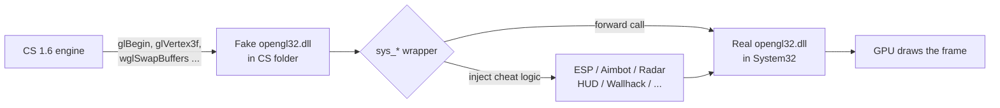
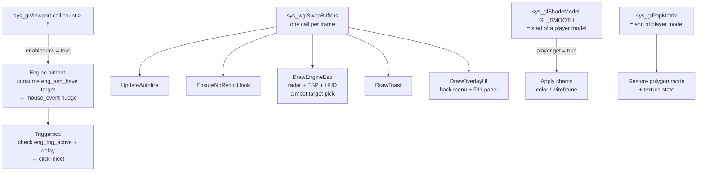

# Architecture — cs16-opengl-research

How the hack is structured and what happens at runtime. For usage instructions
see [README.md](./README.md). For build instructions see [BUILDING.md](./BUILDING.md).

---

## Table of Contents

- [Proxy DLL concept](#proxy-dll-concept)
- [High-level architecture](#high-level-architecture)
- [Per-frame pipeline](#per-frame-pipeline)
- [Feature internals](#feature-internals)
  - [Wallhack](#wallhack)
  - [Engine entity-list ESP](#engine-entity-list-esp)
  - [Radar](#radar)
  - [Own HUD (HP / Ammo arcs)](#own-hud-hp--ammo-arcs)
  - [Team detection (ESP colors + aim side-filter)](#team-detection-esp-colors--aim-side-filter)
  - [Player flags & bomb ESP (ScoreAttrib + BombDrop)](#player-flags--bomb-esp-scoreattrib--bombdrop)
  - [Design note: the abandoned spectator warning ("who's watching me")](#design-note-the-abandoned-spectator-warning-whos-watching-me)
  - [Chams](#chams)
  - [Aimbot](#aimbot)
  - [Triggerbot](#triggerbot)
  - [Auto-fire](#auto-fire)
  - [Auto bunnyhop](#auto-bunnyhop)
  - [No-recoil detour](#no-recoil-detour)
  - [No Flash / No Smoke / No Sky](#no-flash--no-smoke--no-sky)
  - [Hack menu and config persistence](#hack-menu-and-config-persistence)

---

## Proxy DLL concept

The game renders through `opengl32.dll`. Windows looks for a DLL in the
**application folder first**, before the system folder. Dropping a fake
`opengl32.dll` into the CS directory causes the game to load it instead of the
real one. The fake DLL re-exports every OpenGL function (via `opengl32.def`),
forwards them to the real DLL, and inserts cheat logic in between — invisible
to the game and engine.

---

## High-level architecture

```mermaid
flowchart LR
    A[CS 1.6 engine] -->|glBegin, glVertex3f,\nwglSwapBuffers ...| B[Fake opengl32.dll\nin CS folder]
    B --> C{sys_* wrapper}
    C -->|inject cheat logic| D[ESP / Aimbot / Radar\nHUD / Wallhack / ...]
    C -->|forward call| E[Real opengl32.dll\nin System32]
    D --> E
    E --> F[GPU draws the frame]
```

Every OpenGL call made by the game (`glBegin`, `glVertex3f`, `glViewport`,
`wglSwapBuffers`, …) passes through a matching `sys_*` wrapper in `opengl32.cpp`.
The wrapper runs the cheat logic, then calls the real function via a saved pointer.

---

## Per-frame pipeline

```mermaid
flowchart TD
    VPcount[sys_glViewport call count ≥ 5]
    VPcount -->|enabledraw = true| AIM[Engine aimbot:\nconsume eng_aim_have target\n→ mouse_event nudge]
    AIM --> TRIG[Triggerbot:\ncheck eng_trig_active + delay\n→ click inject]

    SWAP[sys_wglSwapBuffers\none call per frame]
    SWAP --> AF[UpdateAutofire]
    SWAP --> NR[EnsureNoRecoilHook]
    SWAP --> ESP[DrawEngineEsp\nradar + ESP + HUD\naimbot target pick]
    SWAP --> TOAST[DrawToast]
    SWAP --> UI[DrawOverlayUI\nhack menu + F11 panel]

    SHADEMODEL[sys_glShadeModel GL_SMOOTH\n= start of a player model]
    SHADEMODEL -->|player.get = true| CHAMS[Apply chams\ncolor / wireframe]
    POPMATRIX[sys_glPopMatrix\n= end of player model]
    POPMATRIX --> RESTORE[Restore polygon mode\n+ texture state]
```

Key timing facts:
- **`wglSwapBuffers`** is called exactly once per rendered frame — all overlay
  drawing (ESP, radar, menu, toast) happens here.
- **`glViewport`** is called many times per frame; the 5th call enables drawing
  and also runs the aimbot mouse nudge (one nudge per frame).
- **`glShadeModel(GL_SMOOTH)`** marks the beginning of a player model; the
  flag is cleared in `glPopMatrix`.

---

## Feature internals

### Wallhack

Implemented in `sys_glBegin` / `sys_glPopMatrix`. When `cvar.wall` is non-zero
and a player model is drawing (`bWall = true` set by `glPushMatrix`):

| Mode | Effect |
|------|--------|
| `wall 1` | `glDisable(GL_DEPTH_TEST)` on `GL_TRIANGLE_FAN/STRIP` — model paints over walls |
| `wall 2` | Depth off + `GL_SRC_ALPHA, GL_ONE` blend — additive glow |
| `wall 3` | Depth off + `GL_SRC_ALPHA_SATURATE` blend — saturate blend |

The depth test is restored in `sys_glPopMatrix` after each model.

---

### Engine entity-list ESP

Instead of guessing players from vertex counts, the ESP reads the GoldSrc
engine's own entity list at runtime.

**Finding the engine table (`cl_enginefunc_t`):** The engine hands a function
table to `client.dll`. We scan `client.dll`'s readable data pages for a run of
≥ 8 consecutive pointers that all land inside `hw.dll`, then verify slots 51
(`GetLocalPlayer`) and 53 (`GetEntityByIndex`). This gives a stable pointer to
the table without any signature scanning.

**Per-player data extracted each frame:**
- World origin (`ENT_ORIGIN` / `entity_state_t::origin`) for 3D → 2D projection
- Hull type (`usehull`) to compute standing vs. ducking height for box sizing
- Team via a three-tier resolution (see *Team detection* below): the `TeamInfo`
  user-message first, then `g_PlayerExtraInfo`, then a model-name guess
- Alive / stale via `current_position` update counter + 400 ms timeout

**WorldToScreen:** via `pTriAPI` slot 12 (`WorldToScreen`), the engine's own
projection — no manual matrix math needed.

**Visibility check (`esp_vischeck`):** `gluProject` maps the enemy chest to
screen space, then `glReadPixels(GL_DEPTH_COMPONENT)` reads the depth buffer at
that pixel. If the buffer value is ≥ the projected depth (within a small epsilon),
the target is unoccluded.

**Off-screen arrows (`esp_arrow`):** When both head and feet project outside the
viewport, the yaw from `pfnGetViewAngles` is used to compute a screen-edge
direction vector. A filled triangle is drawn at the rim pointing toward the enemy.

---

### Radar

Drawn in `DrawEngineEsp` using the same entity loop as the ESP. Each player's
XY offset from the local player is rotated into screen space (optionally following
view yaw with `radar_rotate`), scaled by `radar_zoom`, and clamped to the disc
radius. The radar center is freely positionable via `Move radar` in the menu
(move mode 3).

---

### Own HUD (HP / Ammo arcs)

GoldSrc sends HP, armor, and weapon clip to the client via **user messages**
(`Health`, `Battery`, `CurWeapon`, `DeathMsg`, `ResetHUD`, `TeamInfo`, `ScoreAttrib`,
`BombDrop`, `BombPickup`). The engine keeps a linked list of `usermsg_t` nodes (each holding a name
string and a handler function pointer). We scan private heap pages for nodes matching
those names, save the original handler, and overwrite the pointer with our own. Our
handler reads the value, updates our locals, then calls the original — so the vanilla
HUD keeps working.

Death tracking uses `DeathMsg` (victim index == our index → `me_dead = true`) and
`ResetHUD` (respawn → `me_dead = false`), independent of the HP value so
spectating a live teammate doesn't reset the dead state.

The HP and ammo arcs are drawn as 10-tick `GL_LINES` segments arranged in two
symmetric 96° arcs flanking the crosshair.

---

### Team detection (ESP colors + aim side-filter)

The ESP colors each player by team — **red = T, blue = CT, green = unknown** — and
the aimbot/triggerbot only engage the side selected in the menu. Getting the team
right is therefore load-bearing. Team is resolved in three tiers, most-reliable
first (`DrawEngineEsp`):

1. **`TeamInfo` user-message (primary).** The server broadcasts
   `TeamInfo <playerIndex> <"TERRORIST"|"CT"|"SPECTATOR"|"UNASSIGNED">` to every
   client whenever anyone joins or switches team — it is exactly the source the
   scoreboard is built from. We hook it with the same heap-scan machinery as the
   HP messages (`Hk_TeamInfo` → `eng_msg_team[idx]`, `1 = T`, `2 = CT`). Because it
   is keyed on player index rather than the model, it is correct for **any** model,
   including custom ones, and message names are stable across every build so it
   needs no signature scan.
2. **`g_PlayerExtraInfo` (`EngTeam`).** Reads `teamnumber` out of `client.dll`'s
   extra-info array, located by a byte-pattern scan. Used only when tier 1 hasn't
   supplied a team yet and the scan actually resolved on this build.
3. **Model-name guess (`TeamFromModel`).** Last resort: matches the model string
   against the stock CS model names (`leet`/`arctic`/… → T, `urban`/`gsg9`/… → CT).

**Why the tiers, and the bug tier 1 fixes:** the `g_PlayerExtraInfo` signature is
fragile and fails to resolve on many builds (see the "signature fragility" note on
the message hooks). When it fails, `EngTeam` returns 0 for everyone and team color
falls entirely to `TeamFromModel`. That heuristic only knows the stock models, so
on custom-model maps/servers those players match nothing and render **green on both
sides** — indistinguishable friend from foe. Hooking `TeamInfo` as the primary,
model- and build-independent source eliminates that failure mode; the old tiers
remain as fallbacks. The `esp_dbg` readout shows the active source (`team=msg` /
`extra` / `model`).

---

### Player flags & bomb ESP (ScoreAttrib + BombDrop)

Two more `MSG_ALL`/objective user-messages feed the ESP, hooked with the same
heap-scan machinery as the team/HP messages.

**`ScoreAttrib` (id 84, size 2) — `byte index, byte flags`.** Flags are bitwise:
`1 = DEAD`, `2 = has C4`, `4 = VIP`. The server sends it for every player (it builds
the scoreboard), so it is a global, model/build-independent source. `Hk_ScoreAttrib`:
- stashes the raw flags in `eng_msg_attrib[idx]`; the **`C4/VIP tags`** ESP option
  (`esp_flags`) draws a small orange `C4` / gold `VIP` label at the box top-right.
- feeds a set `DEAD` bit into the *same* `eng_dead_at[]` latch that `DeathMsg` uses.
  This catches deaths we never received a `DeathMsg` for — e.g. joining mid-round, or
  a player who died out of our PVS then walks into view — without disturbing the tuned
  corpse-hide / respawn-release logic.

**`BombDrop` (id, size 7) — `coord x, coord y, coord z, byte flag`.** GoldSrc coords
are little-endian 16-bit fixed point (`short`, units×8), so each is 2 bytes with value
`= short / 8`; `flag` is `BOMB_FLAG_DROPPED 0` / `BOMB_FLAG_PLANTED 1`. This message
drives only the **orange "loose C4 on the ground"** marker, so `Hk_BombDrop` reacts to
the `DROPPED` flag exclusively: it stores the position in `eng_bomb_org`; the **`Bomb
ESP`** option (`esp_bomb`) projects it with `WorldToScreen` and draws an orange dot +
`C4<dist>` label, plus a radar dot. A `PLANTED` flag (or a zero origin) *clears* the
orange marker, because the planted bomb is tracked far more reliably as a world entity
(red marker, below) — otherwise a plant produced a spurious second orange dot.

**`BombPickup` (id, size 0).** The server broadcasts this to alive Terrorists the moment
a dropped C4 is picked up (it's what removes the radar blip). `Hk_BombPickup` mirrors it
by clearing `eng_bomb_flag` — without this hook the orange dropped marker lingered at the
old spot until the next drop.

**Scope caveat (by GoldSrc design):** `BombDrop` is sent only for the *dropped* C4 and
only to **alive Terrorists**. So the orange marker is inherently T-side. The **planted**
bomb — the one both teams actually need — is covered by the world-entity marker below.

**Planted-C4 marker (world entity) — both teams.** Once planted, the bomb exists as an
ordinary networked `grenade` entity using `models/w_c4.mdl` (the *dropped* weaponbox uses
`w_backpack.mdl` instead, so there's no confusion), which every client in PVS receives
regardless of team. So instead of a team-scoped message we find it in the client entity
list: `FindPlantedC4` walks entity slots `33..1024`, reads each `cl_entity_t::model`
(`ENT_MODEL` = `ENT_ORIGIN + 0x4C` per the SDK-stable layout) and matches `model_s::name`
against `w_c4` (`ModelIsC4`). The index is cached in `eng_pc4_idx`; each frame we cheaply
re-verify that one slot and read its origin, and only re-run the full scan at most once per
`ENG_PC4_SCAN_MS` (1000 ms) while we *don't* have it. The throttle is **time-based, not
frame-based**: each scan calls `IsReadable`/`VirtualQuery` per entity, and a `% 8` frame
throttle scans *more* per second the higher the framerate — so at high fps `Bomb ESP` was
visibly dragging fps down while hunting for an unplanted bomb. Time-throttling caps it at
~1 scan/sec regardless of fps (it only sets how fast the marker pops up after a plant / when
the bomb re-enters PVS, negligible against a 35-45s timer); `ResetHUD` resets the throttle so
re-acquire is immediate at round start. The `Bomb ESP`
option (`esp_bomb`) draws it as a **red** dot + `BOMB<dist>` label (red vs the orange
dropped C4), plus a red radar dot. Works for **both T and CT**.

**Liveness (why the marker actually clears).** A defused/exploded/removed entity keeps its
`cl_entity` slot — same `w_c4` model pointer, frozen state — so a plain model match would
re-find that *ghost* forever (the bug that left the red dot up until the next plant). The
fix is `EntLive`: the engine stamps `curstate.messagenum` (`ES_MSGNUM 0x0C`) with the
snapshot's parse number, so an entity whose `messagenum` matches the **local player's**
(always in the latest snapshot) is genuinely present *now*. Both the verify and the scan
require `EntLive`, so ghosts are rejected. A short grace window (`ENG_STALE_MS`) off the
last live sighting prevents flicker on a dropped snapshot; once it lapses the marker
clears itself. Consequence: the red marker tracks the *real* bomb — it disappears within
~`ENG_STALE_MS` of a defuse/explosion (and while the bomb is out of your PVS), instead of
sticking around, and `ResetHUD` also wipes it at round start.

---

### Design note: the abandoned spectator warning ("who's watching me")

**Tried and removed — it does not work, by design of GoldSrc.** The idea was a
safety feature for the ban problem: surface *who* is spectating you (an admin
about to react) near the crosshair so you can play legit the moment someone's on
you. We built two generations of it (a `cvar.spec_warn` near-crosshair block, then
a broadened detector plus an F11 session log) and both were removed after testing.

How it was meant to work: each slot's observer state lives in its `entity_state_t`
(`iuser1` = observer mode, `iuser2` = watched entity index). A spectator was
counted as watching us when `iuser1 > 0` and `iuser2 == eng_local_idx`, with an
origin-match fallback (an in-eye spectator's camera sits on top of its target) for
servers that withhold `iuser2`. We even stopped trusting the `pfnGetPlayerInfo`
`spectator` flag and read `iuser1` for every named slot, in case the flag was
stripped.

**Why it fails.** GoldSrc servers deliberately **do not replicate spectator data
to ordinary players** — that's the whole point of spectating (admins watch
suspected cheaters covertly). So on a normal client the spectator slots simply
never arrive: the player list shows no spectator flag, and there is no
`entity_state` to read `iuser1/iuser2` from. The F11 diagnostic made this concrete:
across **~100k frames of real play the watcher count never left 0** — not because
the scan wasn't running, but because the bytes are never sent to the client.

**Conclusion (so it isn't re-attempted):** purely client-side spectator detection
is not possible on a standard server. The only leak cases are servers that
misconfigure replication, or an in-eye spectator whose camera origin happens to
coincide with yours — too rare and unreliable to ship. A real solution would need
server-side cooperation (a plugin) or HLTV-list parsing, neither of which a
client-only proxy DLL can do. The feature, its cvars (`spec_warn`/`spec_pad`), the
`ES_IUSER1/2` + `ENG_SPEC_MATCH_R` reads, the menu rows, and the F11 session log
were all removed.

---

### Chams

`sys_glShadeModel(GL_SMOOTH)` fires at the start of every player model. When
`cvar.chams` is on:
- **Solid chams:** `glColor3f(1, 0.15, 0.95)` (magenta) overrides the texture
  color in every `sys_glVertex3f` call during the model.
- **Wireframe chams (`chams_wire`):** `glPolygonMode(GL_FRONT_AND_BACK, GL_LINE)`
  draws only edges. Restored to `GL_FILL` in `sys_glPopMatrix`.

---

### Aimbot

Target selection happens inside `DrawEngineEsp` each frame — the best candidate
(closest screen-space distance to crosshair within `cvar.fov` px, alive, correct
team) is stored in `eng_aim_sx / eng_aim_sy`. On the next frame, `sys_glViewport`
(5th call) reads this target and emits a `mouse_event(MOUSEEVENTF_MOVE | MOUSEEVENTF_ABSOLUTE)`
nudge, with optional smoothing (`aim_smooth`). `cvar.aimthru` controls whether
a depth-buffer visibility check is required before locking.

**Aim point:** the world-space target is the **center of the head**, computed from
the hull (`halfhA + zoffA - AIM_HEAD_CENTER`), not the hull top — the bounding box
extends a few units above the skull. `cvar.aim_point` then shifts this up/down.
Because the ducking hull is half height, the offset is scaled by the duck ratio
(`halfhA / 36`) so a given value stays at the same relative spot on the body in
both stances. `cvar.aim_dot` (the **Head dot** toggle) draws a small filled circle
at this exact point for any on-screen target-team enemy, so the user can see and
tune where the aimbot will land before hiding it again.

**Activation gate:** `cvar.aim_mode` decides *when* the mouse nudge is allowed —
**Always**, **Hold** (only while `cvar.aim_key` is down), or **Toggle** (the key
latches an on/off state). The key is resolved from a shared index→virtual-key
table (`KeyTableVK`) and read with `GetAsyncKeyState` inside `sys_glViewport`; the
toggle is edge-detected so it flips exactly once per physical press regardless of
how many times the viewport hook runs that frame.

#### Design note: the abandoned "real hitbox" (real-geometry) aim point

We tried replacing the hull-derived head point with a point taken from the
player's **actually drawn geometry**, and removed it again because it was
*less* accurate than the fixed point. Recording the reasoning so we don't
re-attempt the same dead end.

**What was tried.** GoldSrc software-skins studio models and submits their
vertices in **world space** through our `glVertex` hooks, bracketed by
`glShadeModel(GL_SMOOTH)` (model start) and `glPopMatrix` (model end). The
experiment accumulated each drawn model's world-space axis-aligned bounding box
(AABB) during the scene, then in `DrawEngineEsp` matched a box to a player and
aimed at the box **top** (intended as the real head crown), so the aim height
would track ducking / jumping / animation that the constant hull can't. It was
exposed as a **"Real hitbox"** toggle (`aim_bone`).

**Why it was worse.** An AABB of the whole moving model is not a head:
- The box top is pulled **above the skull** by raised arms, the held weapon, and
  running/animation poses, so the aim point floated above the head and, at an
  angle, projected off to the side ("above the head / on the arm").
- A held-weapon model is submitted too; its compact box could win the
  player-match and drag the point down to **hand height**. Tightening the match
  to the tallest body-sized box (`ENG_MIN_BODY_H`) reduced but didn't remove this.
- The box reshapes every frame as the model animates, so even after anchoring the
  **horizontal** aim back to the entity origin (which made XY identical to the
  fixed point), the **vertical** stayed noisy — the point visibly jittered.

So the only thing the box added over the fixed point was a *noisier* vertical, for
no real gain. The fixed point (constant offset from the rock-steady entity origin,
scaled by the duck ratio) lands on the head consistently and feels better in play.

**The only approach that would actually beat the fixed point** is reading the
engine's per-player **head bone** transform from `hw.dll` — a precise head point
that tracks animation without the box noise. We did **not** do this: it needs
per-build memory signatures (bone-matrix array pointer + per-model head bone
index) that can't be verified without running the exact CS build, and a wrong
signature crashes the game. If head-accurate aim is ever revisited, that bone-read
path — not a vertex bounding box — is the route to take.

Removed in full: the `aim_bone` cvar, the `Real hitbox` menu row, `MatchPlayerBox`,
and the per-model AABB capture in `sys_glShadeModel` / `sys_glVertex3f` /
`sys_glVertex3fv` / `sys_glPopMatrix`.

---

### Triggerbot

`DrawEngineEsp` tests each frame whether the screen-space crosshair (viewport
center) falls inside any enemy's projected 2D bounding box. If yes,
`eng_trig_active = true` and `eng_trig_acq` records the timestamp. In
`sys_glViewport`, once `(now - eng_trig_acq) ≥ trigger_delay` ms and the
120 ms refractory period has passed, a `LEFTDOWN + LEFTUP` pair is injected.

---

### Auto-fire

A low-level mouse hook (`WH_MOUSE_LL`) on a dedicated thread tracks the physical
left-button state (ignoring injected clicks via `LLMHF_INJECTED`). When the
button is physically held and `cvar.autofire` is on, the hack alternates one
frame releasing (UP) and the next frame pressing (DOWN) at `autofire_rate` ms
intervals. GoldSrc fires one shot per 0→1 edge of `IN_ATTACK`, so this alternate
approach produces clean, reliable shots at the configured rate.

---

### Auto bunnyhop

GoldSrc adds `PM_PreventMegaBunnyJumping`, which caps bhop speed at `1.7 ×
sv_maxspeed` and *penalises* overshoot, and a jump only fires on the 0→1 edge of
`+jump` on the exact frame you touch the ground — a ~1-tick window that's almost
impossible to hit by hand. This cheat can't change server cvars, but it can nail
the timing:

- `DrawEngineEsp` reads the local player's `curstate.onground` each frame
  (`ENT_CURSTATE + ES_ONGROUND`; `-1` = airborne) and stores it in `eng_on_ground`.
- `sys_glViewport` then **holds `SPACE` down while grounded and releases it in the
  air** via `keybd_event`. Because it releases every airborne frame, each landing
  produces a fresh press edge, so the engine jumps the instant you touch down.
- `cvar.bhop_hold` gates this to a held key (`cvar.bhop_key`, same key table as the
  aim key) or leaves it always-on. The injected jump key is `SPACE`, distinct from
  the (mouse/other) hold key, so `GetAsyncKeyState` on the hold key stays reliable.

This assumes jump is bound to `SPACE` (the default). The `onground` offset is for
engine build 4554, consistent with the rest of the entity-state offsets.

---

### No-recoil detour

`client.dll` exports `V_CalcRefdef(ref_params_s*)`, which adds
`pparams->punchangle` (the view kick) to the camera angles. We locate the export
via `GetProcAddress`, save the first 5 bytes, and overwrite them with a relative
`jmp` to `Hooked_VCalc`. Our hook zeroes `punchangle` **before** the original
runs, eliminating the visual kick. The detour uses unhook/call/re-hook (safe
because the render thread is single-threaded) to avoid needing a disassembler
trampoline.

---

### No Flash / No Smoke / No Sky

- **No Flash:** `sys_glBegin(GL_QUADS)` samples the current color. If it is
  pure white (1,1,1), `bFlash = true`. In `sys_glVertex2f`, when `bFlash` is
  set and the vertex `y` equals the viewport height (full-screen quad), the color
  alpha is set to 0.01 — making the flash nearly invisible.
- **No Smoke:** color components are equal, non-zero, non-one during smoke quads.
  `bSmoke = true` causes `sys_glVertex3fv` to silently return, skipping the
  geometry.
- **No Sky:** `bSky = true` during `GL_QUADS` primitives. When the engine later
  calls `glClear(GL_DEPTH_BUFFER_BIT)` while sky is active, we replace it with
  `GL_COLOR_BUFFER_BIT | GL_DEPTH_BUFFER_BIT` — clearing sky color and preventing
  it from painting over the world.

---

### Hack menu and config persistence

The menu is data-driven: a static `mitem_t` array defines every row (label, type,
cvar pointer, range, dependency). The scroll window, animated highlight bar, and
fade-in/out all run from a single `UpdateMenuAnim()` call each frame.

**Two config files:**
- `oglconf.cfg` — shipped defaults. Loaded once on `F12`.
- `oglsave.cfg` — auto-written on every menu change via `SaveSettings()`.
  Loaded after `oglconf.cfg` on `F12` so user tweaks override defaults.
  Pressing `F10` resets everything back to `oglconf.cfg` defaults and deletes
  `oglsave.cfg`.

Panel positions (menu, F11, radar) are draggable with the **Move** entries and
persist in `oglsave.cfg`.