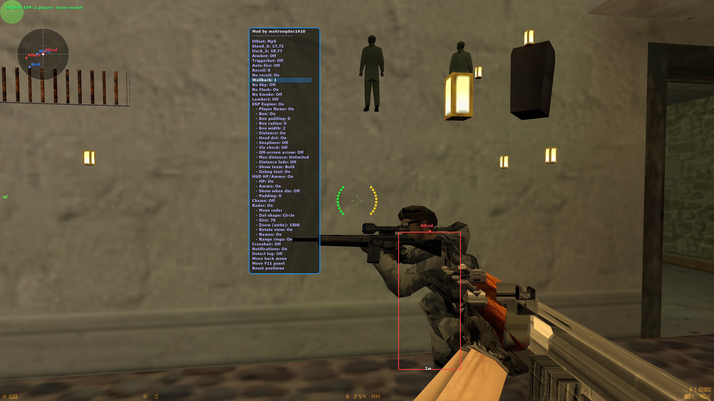
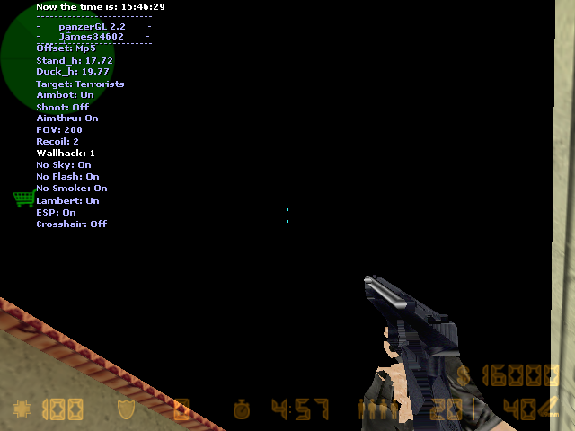

# cs16-opengl-research

A study of a classic **OpenGL wrapper hack** for Counter-Strike 1.6 (GoldSrc engine),
based on the discontinued *panzerGL 2.2* multi-mod. The hack ships as a fake
`opengl32.dll` that the game loads instead of the real one, then intercepts OpenGL
draw calls to implement wallhack, ESP, aimbot, radar, and a set of visual tweaks
— all heavily expanded and modernized from the original.

  

<video src="https://github.com/user-attachments/assets/13b489dc-080a-48f3-9f50-91764662208b" controls loop muted></video>

> [!NOTE]
> **This repository is for technical research and educational purposes only.**
> The goal is to understand how render-layer game hacks work (DLL proxying,
> OpenGL interception, depth-buffer manipulation, engine entity-list reading).
> Do **not** use this on online/official servers. Using it against other players
> violates game terms of service and is not VAC-safe. Test only against bots or
> on a private/non-Steam server you control. Use at your own risk.

---

## Table of Contents

- [How to use](#how-to-use)
  - [Installation](#installation)
  - [In-game controls](#in-game-controls)
  - [Hack menu options](#hack-menu-options)
- [Screenshots](#screenshots)
- [FAQ](#faq)
- [Going deeper](#going-deeper)
- [Credits](#credits)
- [Hướng dẫn sử dụng (Vietnamese)](#hướng-dẫn-sử-dụng-vietnamese)
  - [Cài đặt](#cài-đặt)
  - [Phím điều khiển trong game](#phím-điều-khiển-trong-game)
  - [Các tùy chọn trong menu hack](#các-tùy-chọn-trong-menu-hack)

---

## How to use

> [!IMPORTANT]
> Your **Counter-Strike 1.6 client must be build 4554 or below**. Newer engine
> builds broke the proxy-DLL technique (and added VAC protections).

### Installation

1. Open the [`things-you-need-to-get-hack-works`](./things-you-need-to-get-hack-works) folder.
2. Copy **both files** into your Counter-Strike 1.6 main directory
   (the folder that contains `hl.exe` / `cstrike`):
   - `opengl32.dll` — the prebuilt hack
   - `oglconf.cfg` — default settings (cvars)
3. Make sure the game is running in **OpenGL** video mode.
4. Launch the game, then press `F12` to enable the hack.

> [!TIP]
> On most laptops (and Mac keyboards running Windows) F-keys require the `Fn`
> modifier, e.g. `Fn + F12`. The `Insert` key may be mapped to `Fn + Enter`.

> [!NOTE]
> If `F11` shows **"Could not load config file"** in red, `oglconf.cfg` is missing
> from the game directory. Make sure it's next to `opengl32.dll` and that the
> extension is not hidden (e.g. not `oglconf.cfg.txt`).

---

### In-game controls

| Key | Action |
|-----|--------|
| `F12` | Master switch — turn the hack **on / off** |
| `Insert` | Open / close the **hack menu** |
| `↑` / `↓` | Navigate menu rows (hold for auto-repeat) |
| `←` / `→` | Change the selected option's value or toggle it |
| `↑` / `↓` / `←` / `→` | Move the active panel (when in move mode) |
| `F11` | Toggle the **debug screen** (config paths, resolution, team detection, no-recoil status) |
| `F10` | **Reset config to defaults** — reloads `oglconf.cfg` and deletes `oglsave.cfg` |

> Every change made in the menu is automatically saved to `oglsave.cfg` and
> restored the next time the hack loads. `F10` wipes that file and brings
> everything back to the shipped defaults.

---

### Hack menu options

Open the menu with `Insert`. Use `↑`/`↓` to scroll, `←`/`→` to change a value.
Sub-options (indented with `- `) are hidden until their parent feature is turned on.

#### Aimbot

| Option | Description |
|--------|-------------|
| **Aimbot** | Enable auto-aim. Snaps the mouse toward the nearest enemy head within FOV. |
| **- Aim smooth** | Smoothing strength (0 = instant snap, 1–10 = progressively slower follow). |
| **- Target** | Which team to aim at (Terrorists / Counter-Terrorists). |
| **- Shoot** | Auto-fire once aimed at a target. |
| **- Aimthru** | Aim through walls. Off = depth-buffer visibility check required. |
| **- FOV** | Screen-pixel radius around the crosshair to search for targets. |
| **- Head dot** | Toggle a dot at the exact point the aimbot aims at (each target-team enemy). Turn it on to tune **Aim point**, then off to hide it. |
| **- Aim point** | Vertical aim offset from head center (`-50..50`; 0 = center of head, +up / −down). Scaled with stance, so the same value stays at the same spot on the body whether the enemy is standing or crouched. |
| **- Aim mode** | When the aimbot assists: **Always** (on whenever Aimbot is enabled), **Hold** (only while the aim key is held), or **Toggle** (the aim key flips it on/off). Hold/Toggle is far more natural and lowers report risk. |
| **- Aim key** | The activation key used by Hold / Toggle mode. Cycle through Mouse R / Mouse 4 / Mouse 5 / Mouse M / Shift / Ctrl / Alt / E / F / C / V / X. |
| **Triggerbot** | Auto-fire when the crosshair rests on an enemy. |
| **- Trigger delay** | Milliseconds to wait before firing (humanization). |
| **Auto-fire** | Spam clicks while holding Mouse1 (auto-pistol / auto-knife). |
| **- Auto-fire rate** | Milliseconds between injected clicks (lower = faster). |
| **Bhop** | Auto bunnyhop — injects perfectly-timed jumps the instant you land, so you keep speed up to the engine's bhop cap. Requires jump bound to **SPACE**. |
| **- Bhop hold** | **Always** (auto-hop whenever Bhop is on) or **Hold** (only while the bhop key is held). |
| **- Bhop key** | The hold key used by Hold mode (same key list as Aim key; default Mouse 5). |

#### Combat / rendering tweaks

| Option | Description |
|--------|-------------|
| **Recoil** | Mouse-down compensation per shot (0 = off, 1–5 = strength). |
| **No recoil** | Zeroes the engine's view-punch via a `V_CalcRefdef` detour — no screen kick. |
| **Wallhack** | 0 = off · 1 = basic (depth test off) · 2 = additive glow · 3 = saturate blend. |
| **No Sky** | Skip rendering the skybox. |
| **No Flash** | Reduce flashbang white to near-zero alpha. |
| **No Smoke** | Skip smoke-grenade geometry. |
| **Lambert** | Force white on all player vertices (fullbright — stay visible in dark areas). |
| **Crosshair** | Draw a custom static crosshair at the screen center. |

#### ESP Engine

The ESP reads the engine's own entity list for real player names, origins, and team data.

| Option | Description |
|--------|-------------|
| **ESP Engine** | Master toggle for the engine-based ESP. |
| **- Player name** | Draw the player's name above the box. |
| **- - Name size** | Font size: 1 = small (7 px) · 2 = normal (10 px) · 3 = large (13 px) · 4 = x-large (16 px). |
| **- - Name padding** | Vertical offset of the name above the box (negative = closer). |
| **- Box** | Draw a 2D bounding box around each player. |
| **- - Box padding** | Grow / shrink the box by this many pixels. |
| **- - Box radius** | Corner rounding (0 = sharp corners). |
| **- - Box width** | Stroke thickness in pixels. |
| **- Distance** | Draw the distance in metres below the box. |
| **- - Dist size** | Font size (same scale as Name size above). |
| **- - Dist padding** | Vertical offset below the box (negative = closer). |
| **- Snaplines** | Line from a screen anchor to each enemy: 0 = off · 1 = bottom · 2 = top · 3 = crosshair. |
| **- Vis check** | Dim ESP when the enemy is occluded (depth-buffer test). |
| **- Off-screen arrow** | Edge-of-screen arrow pointing at enemies outside the viewport. |
| **- Max distance** | Hide ESP beyond this distance in metres (0 = unlimited). |
| **- Distance fade** | Fade ESP alpha with distance (closer = fully opaque). |
| **- Show team** | 0 = both teams · 1 = CT only · 2 = T only. |
| **- Debug text** | Top-left readout showing player count and team-detection method. |

#### HUD

| Option | Description |
|--------|-------------|
| **HUD HP/Ammo** | Master toggle for the own-player HUD arcs around the crosshair. |
| **- HP** | Green arc (left) showing current health in 10% ticks. |
| **- Ammo** | Yellow arc (right) showing current clip in 10% ticks. |
| **- Show when die** | Keep the arcs visible while dead / spectating. |
| **- Padding** | Move the arcs closer to or further from the crosshair. |

#### Chams

| Option | Description |
|--------|-------------|
| **Chams** | Solid-color player models (magenta) visible through walls. |
| **- Chams Wire** | Wireframe mode instead of solid fill. |

#### Radar

| Option | Description |
|--------|-------------|
| **Radar** | 2D mini-map built from the engine entity list. |
| **- Move radar** | Enter move mode — arrow keys reposition the radar disc. |
| **- Dot shape** | 0 = circle · 1 = square. |
| **- Size** | Disc radius in pre-scale units (30–150). |
| **- Zoom (units)** | World units that map to the disc edge (smaller = zoomed in). |
| **- Rotate view** | Rotate the radar so local forward points up. |
| **- Names** | Show a short player name next to each dot. |
| **- Range rings** | Draw two concentric range rings at 1/3 and 2/3 of the zoom radius. |

#### Misc

| Option | Description |
|--------|-------------|
| **Notifications** | Toast pop-ups when toggling features in the menu. |
| **Detect log** | On-screen per-frame enemy / PVS detection counters (top-left). |
| **Move hack menu** | Reposition the hack menu with arrow keys (`Insert` = done). |
| **Move F11 panel** | Reposition the F11 debug panel with arrow keys. |
| **Reset positions** | Snap the menu, F11 panel, and radar back to their default positions. |

---

## Screenshots

| Original panzerGL 2.2 | This version |
|:---------------------:|:------------:|
|  |  |

---

## FAQ

### Why do I only see enemies when they get close on some servers?

Because the wallhack can only reveal what the server actually **sends** to your
client. The engine uses a **PVS (Potentially Visible Set)** table baked into each
map: from your position, only players in potentially visible areas are transmitted.
Enemies in non-visible areas are never sent — so the hack has nothing to draw.

Servers running a recompiled `de_dust2` **without VIS data** transmit all players
all the time, so you see everyone from anywhere. Properly compiled maps cull
aggressively. This is a hard limit of the network layer, not a weakness of the hack.

### Why does it only work on build 4554?

The engine struct offsets and function-table scanning are tuned for engine build
4554 (the most common non-Steam build). Later builds changed those offsets and
added protections. Earlier builds may also work but are untested.

---

## Going deeper

- **[ARCHITECTURE.md](./ARCHITECTURE.md)** — detailed internals: how each feature
  is implemented at the OpenGL / engine level.
- **[BUILDING.md](./BUILDING.md)** — how to compile the DLL yourself, including
  a step-by-step guide for creating the Visual Studio project from scratch.

---

## Credits

- Original *panzerGL 2.2* multi-mod by **james34602**:
  <https://github.com/james34602/panzerGL22>
- Original aimbot & model recognition: *Kenbabutz* (oC Hack source).
- Blank OpenGL wrapper: *Crusader* (Game-Deception).

This repository is a research fork with a modern Visual Studio project, extensive
new features, and documentation on how the hack is built and how it works.

---

## Hướng dẫn sử dụng (Vietnamese)

> [!WARNING]
> **Source code này chỉ dành cho mục đích nghiên cứu kỹ thuật và học tập.**
> Mục tiêu là tìm hiểu cách các bản hack ở tầng đồ họa hoạt động (proxy DLL,
> can thiệp OpenGL, xử lý depth-buffer, đọc danh sách entity của engine).
> **Đừng** dùng trên server online / chính thức. Dùng để chống lại người chơi
> khác là vi phạm điều khoản dịch vụ của game và **không** an toàn với VAC.
> Chỉ test với bot hoặc trên server riêng / non-Steam mà bạn tự quản lý.
> Tự chịu rủi ro khi sử dụng.

> [!IMPORTANT]
> Bản **Counter-Strike 1.6 của bạn phải là build 4554 trở về trước**. Các bản
> engine mới hơn đã chặn kỹ thuật proxy-DLL (và thêm cơ chế chống VAC).

### Cài đặt

1. Mở thư mục [`things-you-need-to-get-hack-works`](./things-you-need-to-get-hack-works).
2. Chép **cả hai file** vào thư mục gốc của Counter-Strike 1.6
   (thư mục có chứa `hl.exe` / `cstrike`):
   - `opengl32.dll` — bản hack đã build sẵn
   - `oglconf.cfg` — cấu hình mặc định (cvars)
3. Đảm bảo game đang chạy ở chế độ video **OpenGL**.
4. Mở game, sau đó nhấn `F12` để bật hack.

> [!TIP]
> Trên đa số laptop (và bàn phím Mac chạy Windows), các phím F cần giữ thêm
> phím `Fn`, ví dụ `Fn + F12`. Phím `Insert` có thể được map thành `Fn + Enter`.

> [!NOTE]
> Nếu `F11` hiện dòng **"Could not load config file"** màu đỏ, nghĩa là thiếu
> file `oglconf.cfg` trong thư mục game. Hãy chắc chắn nó nằm cạnh `opengl32.dll`
> và phần đuôi mở rộng không bị ẩn (không phải `oglconf.cfg.txt`).

### Phím điều khiển trong game

| Phím | Hành động |
|------|-----------|
| `F12` | Công tắc chính — **bật / tắt** toàn bộ hack |
| `Insert` | Mở / đóng **menu hack** |
| `↑` / `↓` | Di chuyển giữa các dòng trong menu (giữ để lặp lại) |
| `←` / `→` | Đổi giá trị hoặc bật/tắt tùy chọn đang chọn |
| `↑` / `↓` / `←` / `→` | Di chuyển panel đang chọn (khi ở chế độ di chuyển) |
| `F11` | Bật/tắt **màn hình debug** (đường dẫn cấu hình, độ phân giải, nhận diện team, trạng thái no-recoil) |
| `F10` | **Khôi phục cấu hình mặc định** — nạp lại `oglconf.cfg` và xóa `oglsave.cfg` |

> Mọi thay đổi trong menu được tự động lưu vào `oglsave.cfg` và khôi phục ở
> lần mở hack tiếp theo. `F10` sẽ xóa file đó và đưa mọi thứ về mặc định ban đầu.

### Các tùy chọn trong menu hack

Mở menu bằng `Insert`. Dùng `↑`/`↓` để cuộn, `←`/`→` để đổi giá trị.
Các tùy chọn con (thụt đầu dòng bằng `- `) chỉ hiện khi tính năng cha được bật.

#### Aimbot (ngắm tự động)

| Tùy chọn | Mô tả |
|----------|-------|
| **Aimbot** | Bật ngắm tự động. Kéo chuột về phía đầu của kẻ địch gần nhất trong vùng FOV. |
| **- Aim smooth** | Độ mượt khi kéo chuột (0 = giật tức thì, 1–10 = càng cao càng chậm/mượt). |
| **- Target** | Ngắm vào phe nào (Terrorists / Counter-Terrorists). |
| **- Shoot** | Tự động bắn khi đã ngắm trúng mục tiêu. |
| **- Aimthru** | Ngắm xuyên tường. Tắt = bắt buộc kiểm tra tầm nhìn bằng depth-buffer. |
| **- FOV** | Bán kính tính bằng pixel quanh tâm ngắm để tìm mục tiêu. |
| **- Head dot** | Bật/tắt một chấm tại đúng điểm aimbot sẽ ngắm tới. Bật lên để canh chỉnh **Aim point**, xong thì tắt đi để ẩn. |
| **- Aim point** | Độ lệch ngắm theo chiều dọc so với tâm đầu (`-50..50`; 0 = chính giữa đầu, + lên trên / − xuống dưới). Tự co giãn theo tư thế, nên cùng một giá trị sẽ giữ nguyên vị trí trên thân dù địch đứng hay ngồi. |
| **- Aim mode** | Khi nào aimbot hỗ trợ: **Always** (luôn bật khi Aimbot bật), **Hold** (chỉ khi giữ phím ngắm), hoặc **Toggle** (phím ngắm bật/tắt). Hold/Toggle tự nhiên hơn nhiều và giảm nguy cơ bị report. |
| **- Aim key** | Phím kích hoạt cho chế độ Hold / Toggle. Lần lượt: Mouse R / Mouse 4 / Mouse 5 / Mouse M / Shift / Ctrl / Alt / E / F / C / V / X. |
| **Triggerbot** | Tự động bắn khi tâm ngắm dừng trên kẻ địch. |
| **- Trigger delay** | Số mili-giây chờ trước khi bắn (giả lập phản xạ người thật). |
| **Auto-fire** | Liên tục click khi giữ Mouse1 (auto cho súng lục / dao). |
| **- Auto-fire rate** | Số mili-giây giữa mỗi lần click giả lập (càng nhỏ càng nhanh). |
| **Bhop** | Auto bunnyhop — tự nhảy đúng thời điểm ngay khi tiếp đất để giữ tốc độ tới giới hạn bhop của engine. Cần gán phím nhảy là **SPACE**. |
| **- Bhop hold** | **Always** (tự nhảy khi Bhop bật) hoặc **Hold** (chỉ khi giữ phím bhop). |
| **- Bhop key** | Phím giữ dùng cho chế độ Hold (cùng danh sách phím với Aim key; mặc định Mouse 5). |

#### Tinh chỉnh chiến đấu / hiển thị

| Tùy chọn | Mô tả |
|----------|-------|
| **Recoil** | Bù giật chuột xuống mỗi phát bắn (0 = tắt, 1–5 = độ mạnh). |
| **No recoil** | Triệt tiêu độ giật góc nhìn của engine qua detour `V_CalcRefdef` — không nảy màn hình. |
| **Wallhack** | 0 = tắt · 1 = cơ bản (tắt depth test) · 2 = phát sáng cộng dồn · 3 = blend bão hòa. |
| **No Sky** | Không vẽ bầu trời (skybox). |
| **No Flash** | Giảm độ trắng của lựu đạn choáng xuống gần như vô hình. |
| **No Smoke** | Không vẽ khói của lựu đạn khói. |
| **Lambert** | Ép tất cả vertex của người chơi thành màu trắng (fullbright — vẫn thấy rõ trong chỗ tối). |
| **Crosshair** | Vẽ một tâm ngắm tĩnh tùy chỉnh ở giữa màn hình. |

#### ESP Engine

ESP đọc trực tiếp danh sách entity của engine để lấy tên thật, vị trí và phe của người chơi.

| Tùy chọn | Mô tả |
|----------|-------|
| **ESP Engine** | Công tắc chính cho ESP dựa trên engine. |
| **- Player name** | Hiện tên người chơi phía trên khung. |
| **- - Name size** | Cỡ chữ: 1 = nhỏ (7 px) · 2 = vừa (10 px) · 3 = lớn (13 px) · 4 = rất lớn (16 px). |
| **- - Name padding** | Độ lệch tên phía trên khung (âm = sát hơn). |
| **- Box** | Vẽ khung bao 2D quanh mỗi người chơi. |
| **- - Box padding** | Phóng to / thu nhỏ khung bao theo số pixel này. |
| **- - Box radius** | Bo góc khung (0 = góc nhọn). |
| **- - Box width** | Độ dày nét vẽ tính bằng pixel. |
| **- Distance** | Hiện khoảng cách (mét) phía dưới khung. |
| **- - Dist size** | Cỡ chữ (cùng thang với Name size). |
| **- - Dist padding** | Độ lệch phía dưới khung (âm = sát hơn). |
| **- Snaplines** | Đường nối từ một điểm neo trên màn hình tới mỗi địch: 0 = tắt · 1 = đáy · 2 = đỉnh · 3 = tâm ngắm. |
| **- Vis check** | Làm mờ ESP khi địch bị che khuất (kiểm tra depth-buffer). |
| **- Off-screen arrow** | Mũi tên ở rìa màn hình chỉ hướng kẻ địch nằm ngoài tầm nhìn. |
| **- Max distance** | Ẩn ESP khi xa hơn khoảng cách này (mét) (0 = không giới hạn). |
| **- Distance fade** | Mờ dần ESP theo khoảng cách (càng gần càng rõ). |
| **- Show team** | 0 = cả hai phe · 1 = chỉ CT · 2 = chỉ T. |
| **- Debug text** | Dòng thông tin góc trên-trái hiện số người chơi và cách nhận diện phe. |

#### HUD

| Tùy chọn | Mô tả |
|----------|-------|
| **HUD HP/Ammo** | Công tắc chính cho các vòng cung HP/đạn quanh tâm ngắm của chính bạn. |
| **- HP** | Vòng cung xanh lá (bên trái) hiện máu hiện tại theo từng nấc 10%. |
| **- Ammo** | Vòng cung vàng (bên phải) hiện số đạn trong băng theo nấc 10%. |
| **- Show when die** | Vẫn hiện các vòng cung khi đã chết / xem (spectate). |
| **- Padding** | Đưa các vòng cung lại gần hoặc ra xa tâm ngắm. |

#### Chams

| Tùy chọn | Mô tả |
|----------|-------|
| **Chams** | Tô đặc màu (hồng cánh sen) cho mẫu nhân vật, nhìn xuyên tường. |
| **- Chams Wire** | Chế độ khung dây thay vì tô đặc. |

#### Radar

| Tùy chọn | Mô tả |
|----------|-------|
| **Radar** | Bản đồ thu nhỏ 2D dựng từ danh sách entity của engine. |
| **- Move radar** | Vào chế độ di chuyển — dùng phím mũi tên để đặt lại vị trí đĩa radar. |
| **- Dot shape** | 0 = hình tròn · 1 = hình vuông. |
| **- Size** | Bán kính đĩa theo đơn vị trước khi scale (30–150). |
| **- Zoom (units)** | Số đơn vị thế giới ứng với mép đĩa (càng nhỏ càng zoom gần). |
| **- Rotate view** | Xoay radar sao cho hướng trước của bạn luôn lên trên. |
| **- Names** | Hiện tên rút gọn cạnh mỗi chấm. |
| **- Range rings** | Vẽ hai vòng cự ly ở 1/3 và 2/3 bán kính zoom. |

#### Misc (khác)

| Tùy chọn | Mô tả |
|----------|-------|
| **Notifications** | Thông báo bật lên khi bật/tắt tính năng trong menu. |
| **Detect log** | Bộ đếm phát hiện địch / PVS theo từng frame (góc trên-trái). |
| **Move hack menu** | Di chuyển menu hack bằng phím mũi tên (`Insert` = xong). |
| **Move F11 panel** | Di chuyển panel debug F11 bằng phím mũi tên. |
| **Reset positions** | Đưa menu, panel F11 và radar về vị trí mặc định. |