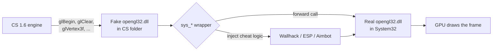
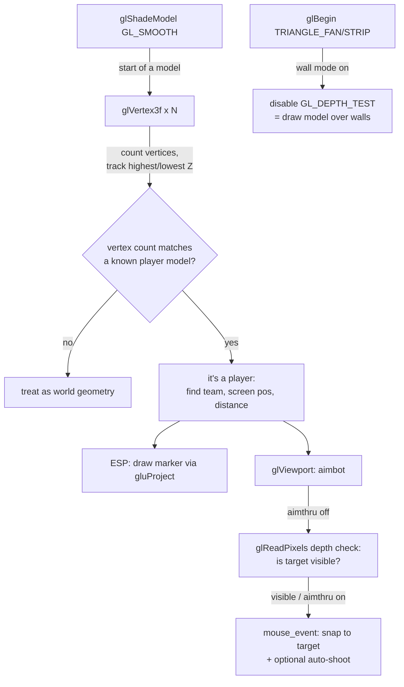

# cs16-opengl-research

A study of a classic **OpenGL wrapper hack** for Counter-Strike 1.6 (GoldSrc engine),
based on the discontinued *panzerGL 2.2* multi-mod. The hack ships as a fake
`opengl32.dll` that the game loads instead of the real one (a "proxy DLL"), then
intercepts OpenGL draw calls to implement wallhack, ESP, aimbot and a few visual
tweaks.

<div align="center">
  
</div>

> [!NOTE]
> **This repository is for technical research and educational purposes only.**
> The goal is to understand how render-layer game hacks work (DLL proxying,
> OpenGL interception, depth-buffer manipulation, vertex-count model detection).
> Do **not** use this on online/official servers. Using it against other players
> violates game terms of service and is not VAC-safe. Test only against bots or
> on a private/non-Steam server you control. Use at your own risk.

---

## Table of Contents

- [How to use](#how-to-use)
  - [In-game controls](#in-game-controls)
  - [Hack menu options](#hack-menu-options)
- [How it works](#how-it-works)
  - [Proxy DLL architecture](#proxy-dll-architecture)
  - [What happens each frame](#what-happens-each-frame)
- [Build from source](#build-from-source)
  - [Requirements](#requirements)
  - [Steps](#steps)
  - [Runtime Library note](#runtime-library-note)
  - [Building from scratch (no `.vcxproj`)](#building-from-scratch-no-vcxproj)
- [FAQ](#faq)
- [Credits](#credits)

---

## How to use

> [!IMPORTANT]
> Your **Counter-Strike 1.6 client must be build 4554 or below**. Newer engine
> builds broke this proxy-DLL technique (and added VAC protections).

1. Open the [`things-you-need-to-get-hack-works`](./things-you-need-to-get-hack-works) folder.
2. Copy **both files** into your Counter-Strike 1.6 main directory
   (the folder that contains `hl.exe` / `cstrike`):
   - `opengl32.dll` — the prebuilt hack
   - `oglconf.cfg` — settings (cvars, aim offsets)
3. Make sure the game is running in **OpenGL** video mode.
4. Launch the game and use the controls below.

### In-game controls

| Key | Action |
|-----|--------|
| `F12` | Master switch — turn the hack **on/off** (also loads `oglconf.cfg`) |
| `Insert` | Open / close the **hack menu** (only visible while the hack is on) |
| `Up` / `Down` | Move the menu selection |
| `Left` / `Right` | Change the selected option's value / toggle it |
| `F11` | Show the **debug screen** (config status, resolution, offsets, teams) |
| `F10` | Cycle the aimbot activation key (Autoaim / Mouse1 / Mouse2 / Mouse3) |

**Quick start:** press `F12` once to enable the hack. Because `oglconf.cfg` ships
with `wall 1`, the wallhack turns on immediately. Press `Insert` to open the menu
and tweak options live.

> [!TIP]
> On most laptops (and Mac keyboards running Windows) the top-row F-keys require
> the `Fn` modifier, e.g. `Fn + F12`. The `Insert` key may also be mapped to
> `Fn + Enter`.

> [!NOTE]
> If `F11` shows **"Could not load config file"** in red, the `.cfg` file is not
> in the game's working directory. Copy `oglconf.cfg`
> next to `opengl32.dll`, and make sure its extension is not hidden
> (e.g. not `oglconf.cfg.txt`).

---

### Hack menu options

| Option | Type | What it does |
|--------|------|--------------|
| **Offset** | preset | Selects a predefined aim-height preset (`stand_h`/`duck_h` pair) from `oglconf.cfg`, named per weapon/style (Mp5, Scout, Headshot, ...). |
| **Stand_h** | value | Vertical aim offset used when the target is **standing**. Higher = aim higher (toward the head). |
| **Duck_h** | value | Vertical aim offset used when the target is **ducked**. |
| **Target** | toggle | Which team the aimbot/ESP targets (`team 0` or `team 1`, names from the model file). |
| **Aimbot** | on/off | Auto-aim: snaps the mouse onto the selected target. |
| **Shoot** | on/off | Triggerbot: automatically fires once aimed. |
| **Aimthru** | on/off | Aim through walls. Off = only aim at visible targets (depth-buffer check); On = ignore walls. |
| **FOV** | value | Size (in pixels) of the screen box around the crosshair within which the aimbot will lock on. Smaller = only near the crosshair. |
| **Recoil** | value (0–5) | Anti-recoil: pushes the mouse down each shot to compensate. |
| **Wallhack** | value (0–3) | 0 = off, 1 = basic see-through (depth test off), 2 & 3 = see-through with color/blend ("chams"-style). |
| **No Sky** | on/off | Skips rendering the skybox. |
| **No Flash** | on/off | Reduces the flashbang full-screen white to near-zero alpha. |
| **No Smoke** | on/off | Skips rendering smoke-grenade geometry. |
| **Lambert** | on/off | Fullbright: forces white on player models so they stay bright in dark areas. |
| **ESP** | on/off | Draws colored markers (triangle/box, colored by team) over detected players. |
| **Crosshair** | on/off | Draws a custom static crosshair in the screen center. |

---

## How it works

The game renders through `opengl32.dll`. Windows loads a DLL from the application
folder **before** the system folder, so a fake `opengl32.dll` dropped into the CS
directory is loaded instead of the real one. It re-exports every OpenGL function
(`opengl32.def`), forwards them to the real DLL, and adds cheat logic in between.

### Proxy DLL architecture



### What happens each frame



**Key ideas:**

- **Wallhack** = turn off the depth test for player models, so they paint on top
  of walls instead of being hidden behind them.
- **Player detection** = read the GoldSrc engine's entity list (`cl_enginefunc_t`)
  for real player names, team and world origins.
- **ESP / Aimbot** = project entity coordinates to screen space (`WorldToScreen` /
  `gluProject`), and read the depth buffer (`glReadPixels`) for line-of-sight checks.

---

## Build from source

The Visual Studio solution is `cs16OpenGL.slnx` (project: `cs16OpenGL/cs16OpenGL.vcxproj`).

### Requirements

- **Visual Studio 2017 or newer** (any edition, including Community) with the
  **"Desktop development with C++"** workload (MSVC toolset + Windows SDK).
- You must use the **MSVC** compiler — the code contains `__asm` inline assembly
  trampolines that only build with MSVC targeting **x86**.

### Steps

1. Open `cs16OpenGL.slnx` in Visual Studio.
2. Set the active configuration to **`Release`** and the platform to **`x86` (Win32)**.
   > CS 1.6 is a 32-bit process, and the inline assembly only compiles for x86.
   > All project settings are stored under the `Release | Win32` configuration; if
   > you select another configuration the settings will appear empty.
3. Build the solution. The output is `Release/opengl32.dll`.

The project already has the required settings for `Release | Win32`:

| Setting | Value | Why |
|---------|-------|-----|
| Configuration Type | Dynamic Library (`.dll`) | It's a DLL |
| Target Name | `opengl32` | Must be named `opengl32.dll` |
| Platform | x86 / Win32 | 32-bit + inline asm |
| Calling Convention | `__stdcall` (`/Gz`) | OpenGL uses `__stdcall`; wrong convention = crash |
| Character Set | Multi-Byte | Code uses ANSI `char*` Win32 APIs |
| Conformance mode | No (`/permissive`) | Allows legacy string-literal → `char*` |
| Preprocessor | `_CRT_SECURE_NO_WARNINGS` | Old CRT functions (`sscanf`, `strcpy`, ...) |
| Module Definition File | `opengl32.def` | Re-exports all OpenGL functions (proxy) |
| Additional Dependencies | `opengl32.lib; glu32.lib; gdi32.lib; user32.lib; winmm.lib` | Required libs |

### Runtime Library note

> [!IMPORTANT]
> This project builds with **Multi-threaded DLL (`/MD`)** by default. The CRT is
> linked dynamically, so the machine running CS 1.6 must have the matching
> **Microsoft Visual C++ Redistributable** installed (any machine with Visual
> Studio already has it).
>
> If you want a **self-contained** DLL that runs on a clean Windows machine with
> no redistributable, switch to **Multi-threaded (`/MT`)**:
> *Project Properties → C/C++ → Code Generation → Runtime Library → `/MT`*.
> The resulting DLL is larger but has no external CRT dependency.

### Building from scratch (no `.vcxproj`)

If you only have the source files and want to create the Visual Studio project
yourself from an empty project, follow the step-by-step guide:
**[BUILD_FROM_SCRATCH.md](./BUILD_FROM_SCRATCH.md)**.

---

## FAQ

### Why does the wallhack only show enemies when they get close on some servers, but reveal them from far away on others — even on the same map (e.g. `de_dust2`)?

Because this wallhack lives at the **very end** of the pipeline. It can only reveal
what the game actually **draws**, and the game only draws the players the **server
chose to send** to your client:

```
Server decides which entities to send  →  client receives  →  engine draws model  →  wallhack reveals it
```

The server filters entities using the map's **PVS (Potentially Visible Set)**.
When a map is compiled, a visibility table is baked in: "from area A, which areas
are potentially visible?". While you're alive at some position, the server only
sends you players in areas within your PVS. Enemies in non-visible areas are
**never transmitted**, so your client doesn't even know they exist → the wallhack
has nothing to draw. That's why you "only see them once they get close."

So why does the *same-named* `de_dust2` behave differently across servers?

- **Different map compiles.** Many servers run a `de_dust2` that was recompiled
  **without VIS data** (or with broken VIS). Then the whole map is one big visible
  region → the server sends **all** players → you see everyone from anywhere.
  A properly VIS-compiled `de_dust2` culls aggressively → you only see nearby
  enemies. (A telltale sign of missing VIS: the map looks fullbright/evenly lit.)
- **Server-side settings / anti-cheat plugins** that cull entities more strictly
  (only send players in line of sight) also limit you to nearby targets.

And why can you **see far when you're dead**? Because death puts you in
spectator/observer mode, where the PVS reference moves (and many servers transmit
more entities to dead players) → a wider set of players reaches your client.

> [!NOTE]
> This is a hard limit of the **network layer**, not a weakness of the hack. Even a
> memory-reading cheat can't reveal an enemy whose data the server never sent —
> it simply isn't in your client's memory.

---

## Credits

- Original *panzerGL 2.2* multi-mod by **james34602**:
  <https://github.com/james34602/panzerGL22>
- Original aimbot & model recognition: *Kenbabutz* (oC Hack source).
- Blank OpenGL wrapper: *Crusader* (Game-Deception).

This repository is a research fork: a modern Visual Studio project plus notes on
how the hack is built and how it works.
